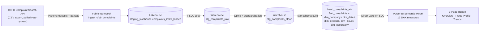
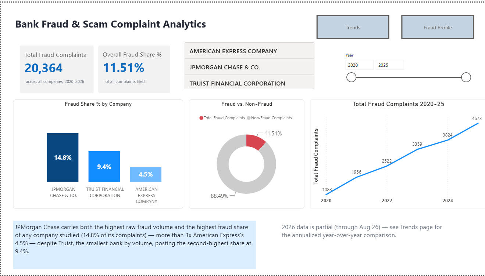
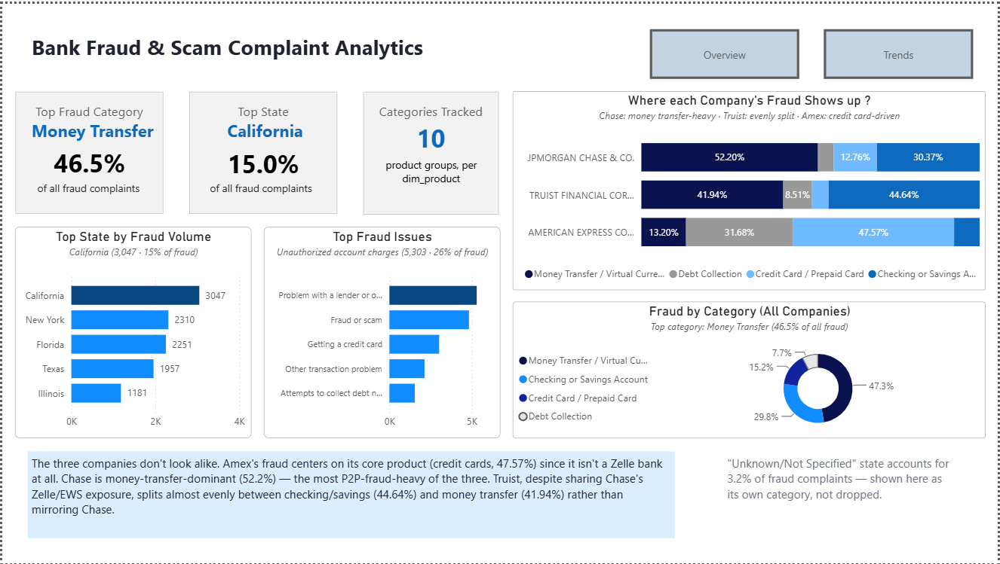
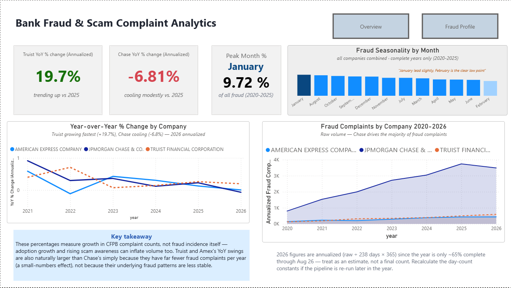
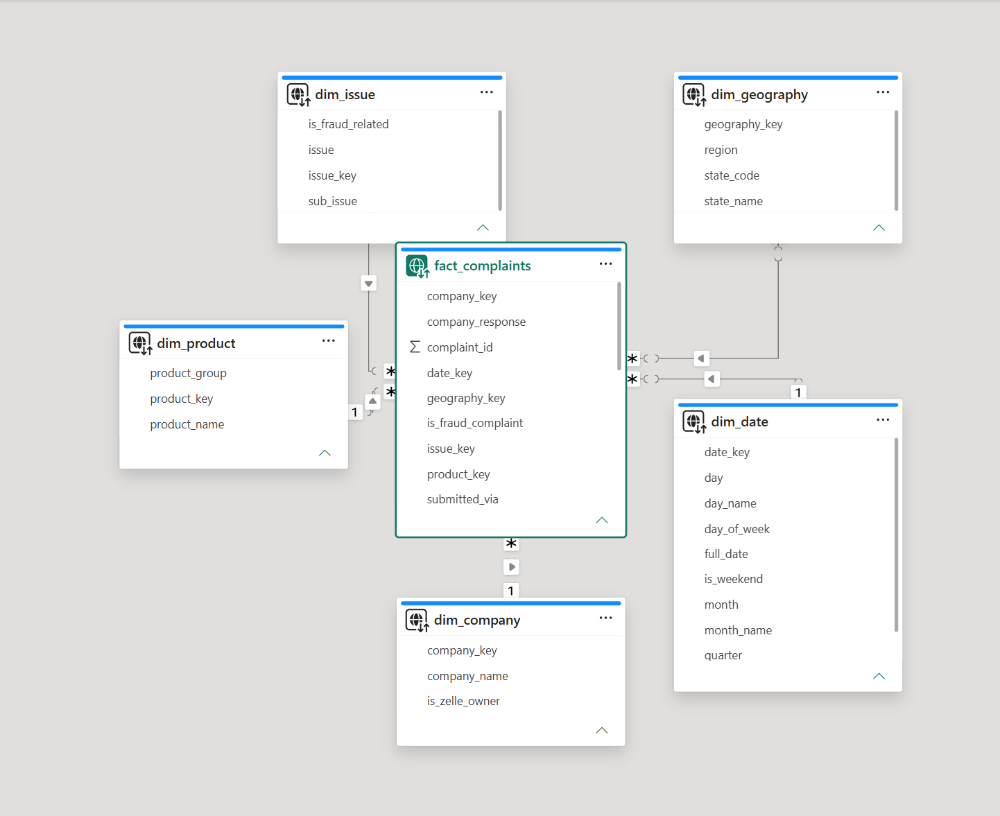
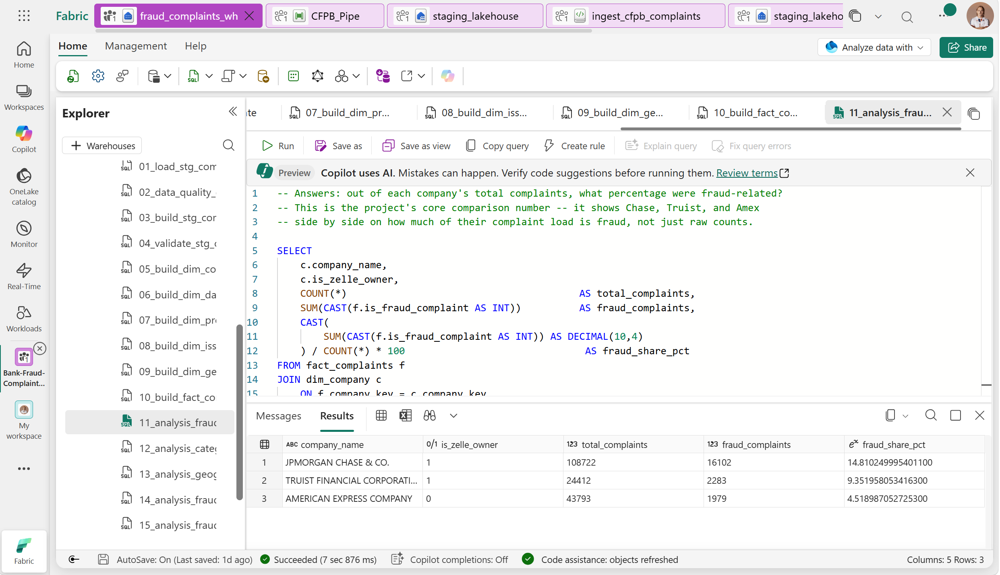
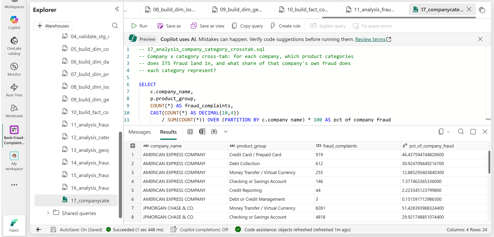

# Bank Fraud & Scam Complaint Analytics

A Microsoft Fabric data warehouse and Power BI dashboard benchmarking fraud- and scam-related complaint patterns across **Truist**, **JPMorgan Chase**, and **American Express**, built on the public CFPB Consumer Complaint Database.


## Why this project

This one started out of curiosity, not a class assignment. After touring Truist's Cyber Fusion Center in Atlanta and reading how much peer-to-peer payment fraud — Zelle scams especially — has become one of the biggest concerns in banking through 2025–2026, I wanted to see what the actual numbers looked like, and how Truist compared to the other side of that Zelle exposure.

Truist and JPMorgan Chase both co-own Early Warning Services, the company that operates Zelle, which puts both banks directly on the hook for this issue. American Express isn't a Zelle bank at all, but it faces the same fraud/dispute-handling pressure on its own payment products — so it made a useful point of contrast rather than just another data point. Instead of building a generic complaint-volume dashboard, this project narrows in specifically on **fraud- and scam-related complaints**, which turned out to be a sharper and more interesting story than a broad benchmarking exercise would have been.

**A data limitation worth calling out up front:** the CFPB stopped publishing free-text complaint narratives and its interactive visualization tool in August 2026. The structured bulk dataset this project relies on — company, product, issue, sub-issue, state, dates — remains fully available via the Complaint Search API, but any narrative-text or NLP angle is off the table going forward. This project is structured-data-only by design, not by omission, and that constraint ended up shaping the fraud-detection logic described below.

## Key findings

- **Fraud share by company** (fraud complaints as a % of each company's own total complaint volume): **JPMorgan Chase 14.8%**, **Truist 9.4%**, **American Express 4.5%**. Chase leads on both raw volume and share; Truist, despite being the smallest of the three, has the second-highest share — smaller bank does not mean lower fraud rate.
- **The three companies do not look alike.** Breaking fraud down by product category *per company* (rather than pooling all three together) shows genuinely different fraud profiles: Amex's fraud centers on its own core product (credit cards, 46.4%) since it isn't a Zelle bank at all; Chase is money-transfer-dominant (51.4%), the most P2P-fraud-heavy of the three; Truist splits almost evenly between checking/savings (43.4%) and money transfer (40.8%) rather than mirroring Chase, despite sharing the same Zelle/EWS exposure.
- **Trend direction (2026, annualized for the partial year):** Truist trending up the fastest (**+19.7%**), Chase cooling modestly (**-6.8%**), Amex essentially flat (**+0.6%**). These figures measure growth in CFPB complaint *counts*, not fraud incidence itself — rising Zelle adoption and growing public awareness of scams can inflate complaint volume independent of whether fraud itself is increasing.
- **Seasonality is fairly flat.** January is the slight peak (9.7% of all fraud complaints, 2020–2025), February the clear low point (6.8%) — neither the tax-season nor holiday-season hypothesis going in produced the sharp spike expected.
- **Geography tracks population**, unsurprisingly: California, New York, Florida, and Texas together account for roughly half of all fraud complaints.

Full findings, with complete tables and methodology notes, are documented in [`docs/sql-scripts-documentation.md`](docs/sql-scripts-documentation.md).

## Architecture



The ingestion notebook pulls from CFPB's Complaint Search API one calendar year at a time (2020–2026) rather than in a single request — JPMorgan Chase alone has over 100K complaints in scope, which was enough to hit the API's result-size limit when requested in one shot. The `consumer_complaint_narrative` field is dropped entirely before it ever reaches the lakehouse, both because it's out of scope by design (see the data limitation above) and because it was the single riskiest field for parsing corruption during early ingestion attempts — see [`docs/ingestion-troubleshooting-log.md`](docs/ingestion-troubleshooting-log.md) for the full story of how a no-code Copy Data pipeline silently shifted columns sideways on a large share of rows, and how that got diagnosed and fixed.

## Tech stack

| Layer | Tool |
|---|---|
| Data source | CFPB Consumer Complaint Database — Complaint Search API (public, free) |
| Workspace/capacity | Microsoft Fabric (trial capacity) |
| Ingestion | Fabric Notebook (Python: `requests` + `pandas`) |
| Storage & transform | Fabric Data Warehouse (T-SQL: staging tables, star schema, views, CTEs, window functions) |
| Dashboard | Power BI (native in Fabric), Direct Lake on SQL |
| Automation (stretch, not yet built) | Scheduled notebook + reload re-run |

## Fraud/scam filter logic

Fraud-related complaints don't live in one clean CFPB category, so the filter pulls from two places, combined into a single `is_fraud_complaint` flag on the fact table:

1. **Product = "Money transfer, virtual currency, or money service"** — the direct Zelle/P2P category.
2. **An explicit, manually-reviewed allow-list of issue/sub-issue pairs** flagged as fraud-related on `dim_issue` (11 of 275 distinct pairs). An earlier attempt using keyword matching (`LIKE '%fraud%'`, `'%scam%'`, `'%identity theft%'`) produced false positives — e.g. billing complaints about a "credit monitoring / identity theft protection" *subscription service* were getting swept in by a keyword match on the category label itself, not on anything about identity theft actually happening. The allow-list replaced that logic entirely.

This split matters: roughly 29% of all fraud complaints get filed under "Checking or Savings Account" rather than the direct money-transfer category, which is exactly why the filter had to reach beyond `Product = "Money transfer..."` alone.

## Repo structure

```
bank-fraud-complaint-analytics/
├── README.md
├── notebooks/
│   └── ingest_cfpb_complaints.ipynb   # Fabric ingestion notebook
├── sql/
│   ├── 01-10_*.sql                    # staging + star schema build
│   └── 11-17_*.sql                    # analysis queries
├── dashboards/
│   └── bank_fraud_analytics.pbix      # exported Power BI report
└── docs/
    ├── sql-scripts-documentation.md   # script-by-script writeup, all 17 scripts
    ├── sql-script-headers.md          # plain-language header comments
    ├── ingestion-troubleshooting-log.md
    └── screenshots/                   # dashboard page screenshots
```

## Dashboard preview

This workspace runs on an org Fabric tenant, so the live report isn't externally shareable — these screenshots stand in for a live link. A `.pbix` backup of the full report is kept in [`dashboards/`](dashboards/).

**Overview** — headline KPIs, fraud share by company, and a 2020-2025 trend teaser.



**Fraud Profile** — where each company's fraud actually shows up, by product category, state, and issue.



**Trends** — annualized year-over-year change by company and fraud seasonality by month.



**Data model** — the actual Power BI semantic model: `fact_complaints` joined to all 5 dimensions, Direct Lake on SQL.



## Proof it runs

Code in a repo is easy to claim and easy to skim past. Beyond the ingestion notebook screenshot in [`docs/ingestion-troubleshooting-log.md`](docs/ingestion-troubleshooting-log.md), here are two of the analysis queries actually executing against the warehouse in Fabric's SQL editor:

**`sql/11_analysis_fraud_by_company.sql`** — the project's single most important number, straight out of `fact_complaints`: Chase 14.8%, Truist 9.4%, Amex 4.5%.



**`sql/17_analysis_company_category_crosstab.sql`** — the company × category cross-tab behind the "these three companies don't look alike" finding, 24 rows, succeeded in 1.4 seconds.



## Data quality notes

A few things worth knowing if you're digging into the SQL:

- The most recent year of data (2026) is **partial** — it runs through August 26, roughly 65% of the year. Year-over-year comparisons involving 2026 are annualized (`raw ÷ 238 days × 365`) rather than compared raw; the seasonality analysis excludes 2026 entirely rather than annualizing, since a partial year distorts month-level patterns differently than year-level ones.
- CFPB's `state` field isn't always a clean 2-letter code — one value in the dataset is the literal text `"UNITED STATES MINOR OUTLYING ISLANDS"` (36 characters), which is why `dim_geography.state_code` is sized as `VARCHAR(50)` rather than assumed to be 2 characters.
- Fabric's T-SQL is a stripped-down subset of full SQL Server: no `DEFAULT` constraints in `CREATE TABLE`, and `SUM()` rejects `BIT` columns directly (needs an explicit `CAST(... AS INT)` first).

## Status

Complete. Ingestion, staging, star schema, and all 17 SQL analysis scripts are done and validated. The 3-page Power BI dashboard (Overview, Fraud Profile, Trends) is built with a full 13-measure DAX semantic layer on top of the warehouse. Screenshots and a `.pbix` backup are included since the report itself isn't externally shareable on this org's Fabric tenant — the trial capacity behind it was time-boxed, so this repo (plus the [portfolio case study](https://gonzalolachica.github.io)) is the durable record of the build.

## Related docs

- [`docs/ingestion-troubleshooting-log.md`](docs/ingestion-troubleshooting-log.md) — full diagnostic log of the ingestion corruption story: a quoting bug → an embedded-newline bug → a blocked request → a wrong company string → an API result-size limit, each isolated and fixed in turn.
- [`docs/sql-scripts-documentation.md`](docs/sql-scripts-documentation.md) — script-by-script writeup of all 17 SQL scripts: purpose, technique, and confirmed results.
- [`docs/sql-script-headers.md`](docs/sql-script-headers.md) — plain-language comment blocks for the top of each script.
